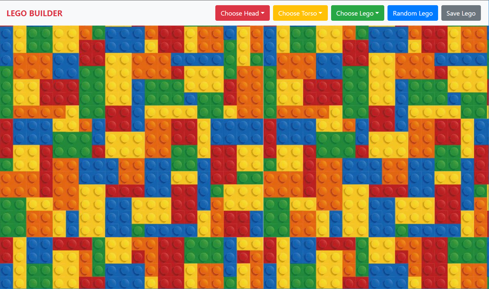
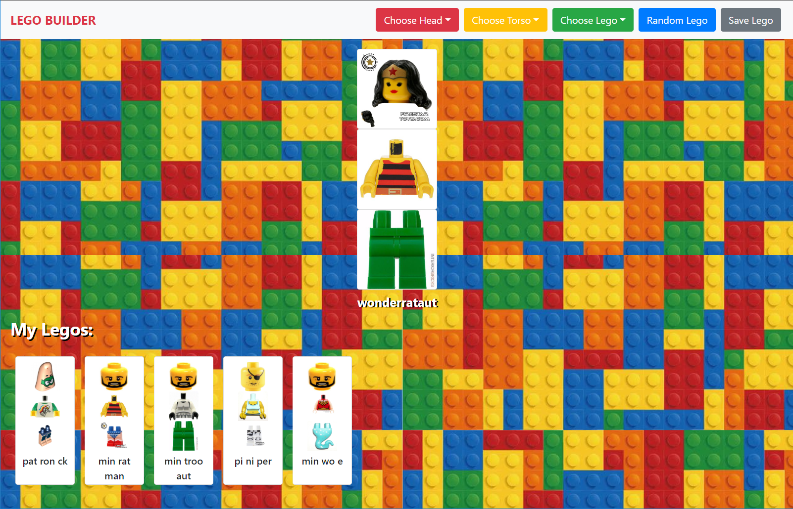
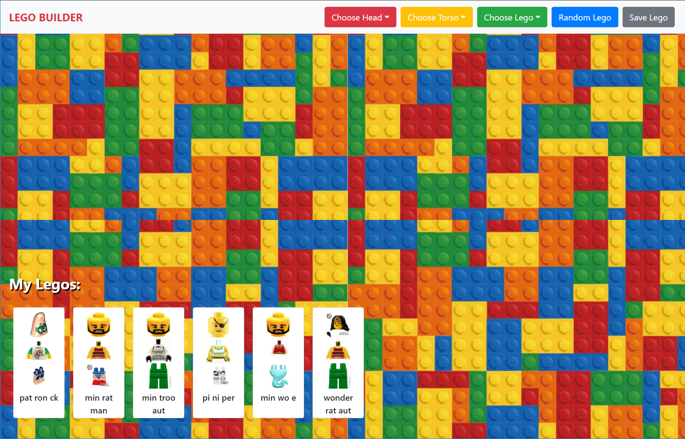

# Lego Builder

### Requirements
- Use for styling your page and components.
- When the user loads the page, they should see a head, a torso, and legs printed together on the page. This is your lego character.
- Your lego character should display with a name that is the mashup of names of the head + torso + legs pieces respectively.
- There should be some way for the user to change the selected head, torso, and leg pieces. You should implement at least one of these:
  1. Three dropdowns or radio button groupings that contain the different pieces within that category the user can choose. When the user chooses an option, it swaps out that lego piece and part of the name. You should populate the options with json data.
  1. When clicking on the head, torso, or leg elements, that lego piece changes (as well as that portion of the name of the character).
  1. Create a randomizer button that will randomly swap out your lego character's pieces and name.
- You should have the ability to save lego characters by clicking on a save button. The saved lego characters should show up with their character's name and optionally with smaller composite thumbnail image. You should be able to save multiple characters (but sadly these will go away when you refresh the page).

 ### Technologies Used
* HTML
* JavaScript
* Bootstrap
* jQuery
* Axios
* Sass
* Firebase
* CRUD
* Webpack

### Screenshots
Homepage

Create a new lego

Saving a lego

### How to run application
1. Set up a new firebase project
2. Configure Firebase
  * In the db folder rename apiKeys.json.example to apiKeys.json
  * Add in the config object from your firebase project
3. Serve up the app
* At the root of the project: `npm install`
* `npm start -p 9999`
* Open chrome and navigate to: `localhost:9999`
 ### Contributors
[Maggie Leavell](https://github.com/mjleavell)
